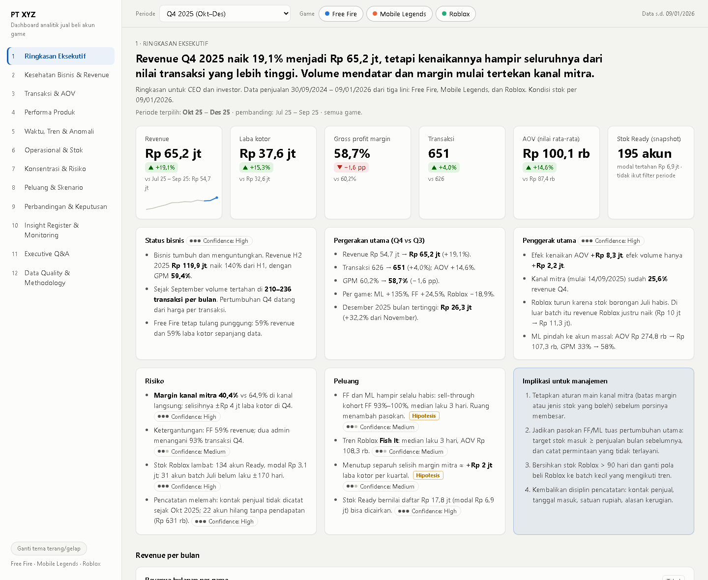
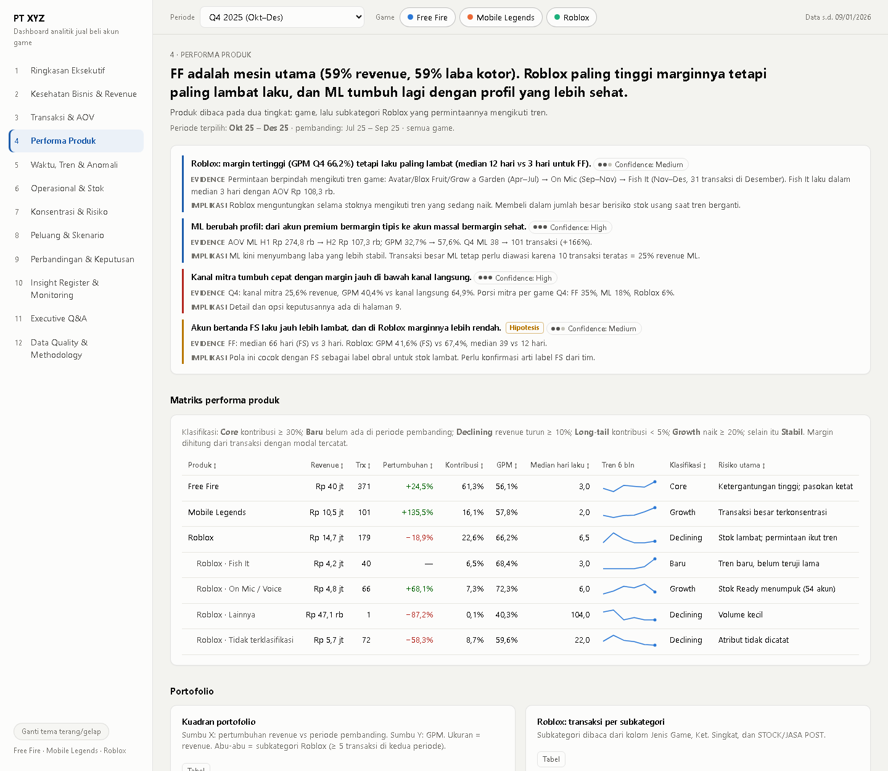

# Dashboard Analitik Jual Beli Akun Game

Analisis penjualan akun Free Fire, Mobile Legends, dan Roblox milik sebuah usaha reseller akun game, dikemas menjadi dashboard interaktif 12 halaman untuk pemilik bisnis dan calon investor.

Nama perusahaan disamarkan menjadi **PT XYZ**, nama admin diganti "Admin A, B, …", dan nilai rupiah sudah disamarkan (lihat [Privasi](#privasi)).

**Dashboard:** buka `docs/index.html` di browser, atau versi online di GitHub Pages repo ini.



## Latar belakang

Pemilik mencatat semua transaksi di tiga spreadsheet terpisah, satu per game. Setiap kali ingin tahu kondisi bisnis, ia harus membuka ketiganya, menjumlahkan angka secara manual, dan membandingkan di kepala. Pertanyaan yang ingin dijawab:

- Apakah bisnis tumbuh, dan pertumbuhannya datang dari mana?
- Game mana yang paling menguntungkan, dan mana yang paling lambat laku?
- Berapa modal yang tertahan di stok, dan di game apa?
- Risiko apa yang perlu diwaspadai, dan keputusan apa yang didukung data?

## Data

- 3 file spreadsheet, 2.401 baris, periode Sep 2024 – 9 Jan 2026.
- Setelah dibersihkan: 1.710 transaksi bertanggal dan 195 akun yang masih menjadi stok.
- Kolom utama: tanggal masuk stok, tanggal terjual, modal (harga beli), harga jual, status, kode akun, catatan admin.
- File mentah **tidak** disertakan karena berisi nomor WhatsApp penjual akun dan angka internal perusahaan.

## Masalah kualitas data terbesar

Sebagian besar waktu habis di tahap ini. Tidak ada baris yang dihapus; setiap koreksi diberi flag sehingga bisa ditelusuri ke baris aslinya.

1. **Tanggal tertukar.** 1.331 sel tanggal ternyata teks format hari/bulan yang dibaca Excel sebagai bulan/hari. Buktinya konsisten: semua sel bertipe tanggal punya "hari" ≤ 12, dan semua tanggal yang tersimpan sebagai teks punya hari > 12. Setelah hari dan bulan ditukar, 98,8% tanggal jual jatuh 0–180 hari setelah tanggal masuk; tanpa ditukar hanya 31,6%.
2. **Satuan rupiah campur.** Sebagian nominal ditulis dalam ribuan (`150` = Rp150.000), sebagian dalam rupiah penuh (`150000`), kadang dalam satu baris yang sama. Aturan "di bawah 1.000 dikali 1.000" saya uji terhadap kolom profit: cocok pada 1.879 dari 1.891 baris (99,4%). Sisanya adalah profit yang ditimpa manual.
3. **Tahun hilang atau salah ketik.** Banyak tanggal Roblox tanpa tahun, dan ada salah ketik saat pergantian tahun (misalnya tertulis Januari 2025 untuk akun yang masuk Desember 2025). Tahun ditentukan dari tanggal snapshot dan urutan baris.
4. **Struktur kolom tidak konsisten.** Nama admin tercecer di beberapa kolom, subkategori Roblox pindah kolom di tengah file, dan banyak baris template kosong.

## Temuan utama (Q4 vs Q3 2025)

- Revenue naik sekitar 19%, tetapi jumlah transaksi hanya naik 4%. Pertumbuhan datang dari nilai per transaksi (AOV), bukan dari volume.
- Kanal mitra re-seller yang mulai September sudah menyumbang sekitar 26% revenue Q4, dengan margin kotor sekitar 40% dibanding sekitar 65% di penjualan langsung. Seluruh penurunan margin Q4 berasal dari kanal ini.
- Akun Free Fire dan Mobile Legends hampir selalu habis (93–100% stok terjual, median laku 3 hari). Dugaan saya, volume lebih dibatasi pasokan daripada permintaan; ini masih hipotesis.
- Revenue Roblox turun karena stok borongan bulan Juli sudah habis. Di luar batch itu, revenue Roblox justru naik.
- 69% stok yang belum laku adalah akun Roblox, game yang paling lambat terjual.

Setiap temuan di dashboard disertai evidence, tingkat keyakinan (High/Medium/Low), dan label **Hipotesis** bila belum bisa dibuktikan dengan data.

## Isi dashboard

| No | Halaman | Pertanyaan |
|---|---|---|
| 1 | Ringkasan Eksekutif | Bagaimana kondisi bisnis sekarang? |
| 2 | Kesehatan Bisnis & Revenue | Tumbuh, stagnan, atau menurun? |
| 3 | Transaksi & AOV | Pertumbuhan dari volume atau nilai transaksi? |
| 4 | Performa Produk | Game dan subkategori mana yang jadi penggerak? |
| 5 | Waktu, Tren & Anomali | Kapan perubahan terjadi, signal atau noise? |
| 6 | Operasional & Stok | Di mana hambatan stok, admin, dan pasokan? |
| 7 | Konsentrasi & Risiko | Seberapa besar ketergantungan bisnis? |
| 8 | Peluang & Skenario | Peluang apa yang didukung data? (dengan simulator) |
| 9 | Perbandingan & Keputusan | Opsi keputusan apa saja, beserta kelebihan dan risikonya? |
| 10 | Insight Register & Monitoring | Apa yang perlu dipantau, dengan ambang batas berapa? |
| 11 | Executive Q&A | 23 pertanyaan yang kemungkinan diajukan investor |
| 12 | Data Quality & Methodology | Seberapa andal analisis ini? |

Filter periode dan game di bagian atas berlaku untuk semua halaman. Setiap grafik punya tooltip dan tombol **Tabel** untuk melihat angka di baliknya, dan semua tabel bisa diurutkan. Tersedia mode terang/gelap, dan tampilan menyesuaikan layar ponsel.



## Cara kerja

```
data/raw/*.xlsx  ──>  01_clean.py  ──>  02_build_data.py  ──>  03_build_html.py  ──>  docs/index.html
 (tidak di-commit)    parse & flag      metrik + penyamaran     rakit 1 file HTML
```

- `scripts/01_clean.py`: membaca ketiga file, memperbaiki tanggal dan satuan, menghitung ulang profit, dan memberi flag pada setiap koreksi.
- `scripts/02_build_data.py`: menghitung metrik, lalu menyiapkan data versi internal dan versi publik yang disamarkan.
- `scripts/03_build_html.py`: menggabungkan data, CSS, dan JavaScript menjadi satu file HTML mandiri tanpa dependensi eksternal.
- `dashboard/`: sumber tampilan. Grafik digambar langsung dengan SVG tanpa library chart.

Menjalankan ulang (butuh file mentah):

```bash
pip install -r requirements.txt
cp config.example.json config.local.json   # isi nama perusahaan, admin, dan kode mitra
python scripts/01_clean.py
python scripts/02_build_data.py
python scripts/03_build_html.py
```

## Privasi

- File mentah, nomor kontak, ID akun game, username, dan tautan Google Drive tidak pernah masuk repo.
- Nama perusahaan, nama admin, dan kode mitra hanya ada di `config.local.json` yang tidak di-commit.
- Nilai rupiah di versi publik dikalikan faktor rahasia dengan variasi kecil per transaksi (±4%), sehingga harga asli tidak bisa ditebak. Tanggal, jumlah transaksi, dan kelas harga tetap sesuai data asli; persentase dan rasio hanya bergeser sangat kecil (umumnya di bawah 0,2 poin).

## Keterbatasan

- Biaya operasional tidak tercatat, jadi analisis berhenti di laba kotor.
- Tidak ada data pembeli, sehingga analisis pelanggan (repeat order, retensi) tidak bisa dilakukan.
- Data berhenti 9 Januari 2026, dan baru ada satu Desember, sehingga pola musiman belum bisa disimpulkan.

## Teknologi

Python (pandas, openpyxl) untuk pembersihan dan analisis; HTML, CSS, dan JavaScript murni untuk dashboard; GitHub Pages untuk hosting.
